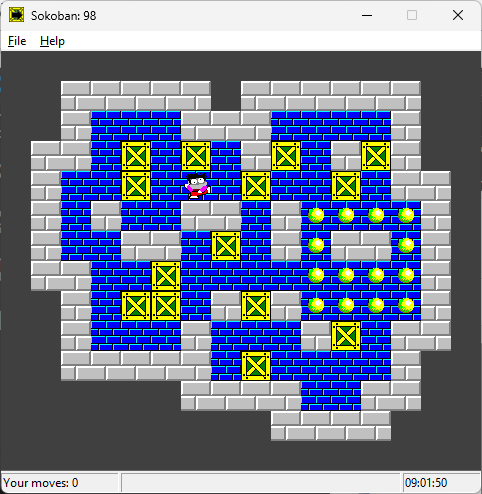

# Sokoban
Sokoban is a puzzle game in which the player pushes boxes around in a warehouse, trying to get
them to storage locations. The warehouse is a grid composed of floor squares and impassable wall
squares. Some floor squares contain a box and some are marked as storage locations. The number
of boxes equals the number of storage locations.

